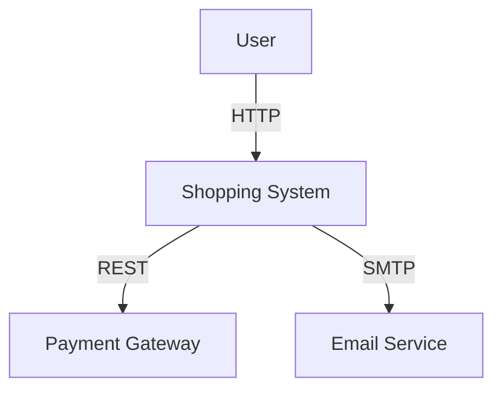
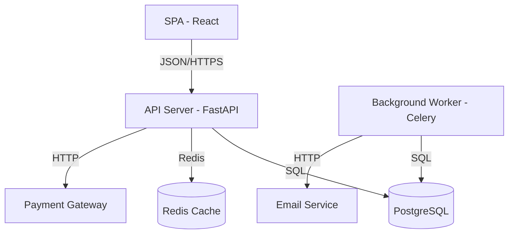
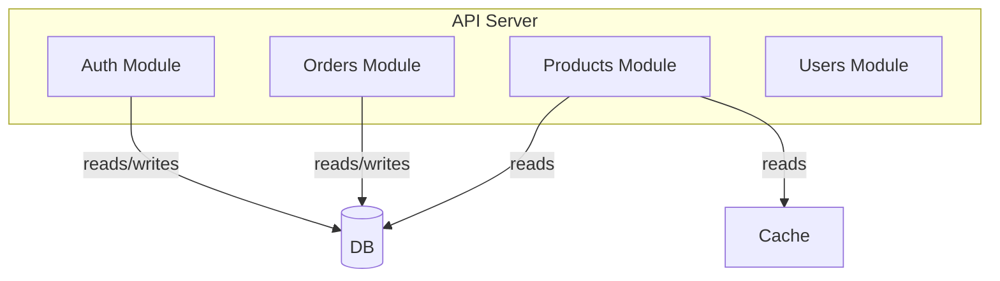
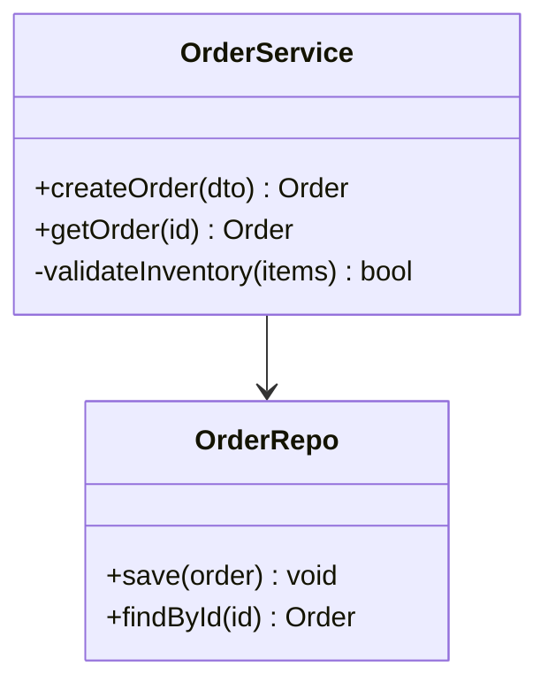
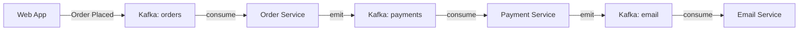

# Architecture Documentation Skill

## Core Principle
**Stale docs are worse than no docs.** Keep architecture docs close to the code and update them when the code changes. A diagram that shows the wrong architecture is actively misleading.

## ADRs (Architecture Decision Records)

### Format

```markdown
# ADR-001: Use PostgreSQL for the primary data store

## Status
Accepted

## Context
We need a primary data store for user accounts, orders, and inventory.
The system needs strong consistency, ACID transactions, and geographic
replication. Team has more PostgreSQL experience than CockroachDB.

## Decision
We will use PostgreSQL 16 with the following configuration:
- Managed RDS instance with Multi-AZ
- Read replicas for reporting queries
- pgBouncer for connection pooling

## Consequences
- + Strong consistency and ACID compliance
- + Rich ecosystem of extensions (PostGIS, pgvector)
- - Read scaling requires application-level sharding or read replicas
- - Horizontal write scaling requires partitioning at the app layer

## Options Considered
| Option | Pros | Cons |
|--------|------|------|
| PostgreSQL | Team expertise, ACID, extensions | Write scaling ceiling |
| CockroachDB | Horizontal scaling, wire-compatible | Higher latency, less ecosystem |
| DynamoDB | Scale, managed | No joins, eventual consistency |
```

### When to Write an ADR

Write an ADR when you make a significant decision with:
- **Alternatives** — You considered more than one option
- **Consequences** — The decision has non-trivial trade-offs
- **Durability** — People will ask "why did we do this?" in 6 months

### Lightweight vs Detailed

| Type | When | Length |
|------|------|--------|
| Lightweight | Small team, fast iteration | 3-5 sentences |
| Detailed | Distributed team, regulatory | Full sections |

## C4 Model Diagrams

### Level 1: System Context


### Level 2: Containers


### Level 3: Components


### Level 4: Code


## Data Flow Documentation

For event-driven or streaming systems, document the data flow:



## ASCII Art for Terminal-Friendly Docs

```
┌─────────────┐     ┌──────────────┐     ┌─────────────┐
│   Client    │────▶│   API GW     │────▶│   Services  │
└─────────────┘     └──────────────┘     └──────┬──────┘
                                                 │
                                          ┌──────▼──────┐
                                          │  Database   │
                                          └─────────────┘
```

## Tools

| Tool | Best For |
|------|----------|
| Mermaid | Markdown-native diagrams (GitHub, GitLab) |
| PlantUML | Complex UML, C4 models |
| Structurizr | C4 model with DSL, code-as-diagram |
| Excalidraw | Whiteboard-style, ad-hoc diagrams |
| adr-tools | CLI for managing ADRs |
| log4brains | ADR management with web UI |

## Keeping Docs Current

- **Docstrings ≠ architecture docs** — code-level docs live in code; arch docs live with the system
- **CI check**: Fail CI if ADRs haven't been updated when architecture-affecting code changes
- **Review cadence**: Quarterly architecture review — update docs or archive stale ones
- **Single source of truth**: One doc per aspect; link between them rather than duplicating
