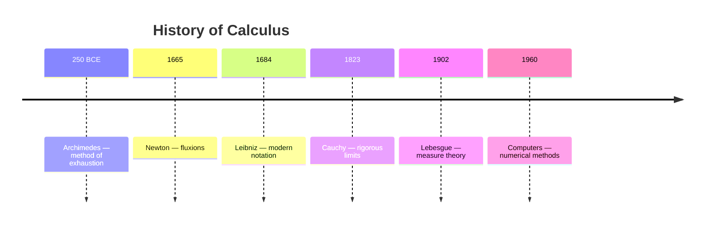
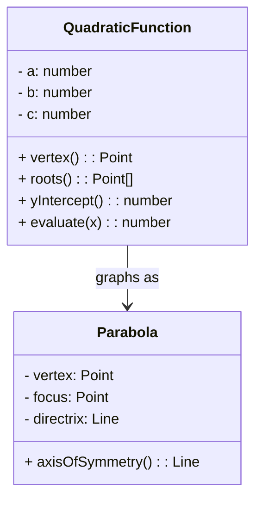

# Math Infographic Designer

Skill for creating math infographics and visual learning aids. Use when the user asks for a poster, infographic, visual summary, concept map, flowchart, or study guide.

## Infographic Types

### Concept Maps
- Central node: the main topic (e.g., "Quadratic Functions")
- Tier 1 branches: major subtopics (Standard Form, Vertex Form, Factored Form)
- Tier 2 branches: properties (vertex, axis of symmetry, roots, y-intercept)
- Tier 3: examples, formulas, graphs
- Best for: unit reviews, topic introductions

### Flowcharts
- Decision diamond: question or condition
- Rectangles: actions or steps
- Parallelograms: input/output
- Oval: start/end
- Best for: problem-solving strategies, procedures

### Timelines
- Horizontal or vertical line with labeled nodes
- Date/era markers with brief description and significance
- Short vertical connectors for detailed notes
- Best for: history of math, development of a concept

### Comparison Charts
- Two or three columns, side-by-side
- Rows: properties/characteristics to compare
- Icons or checkmarks for presence/absence
- Best for: function families, shape properties, number systems

### Process Diagrams
- Numbered steps connected by arrows
- Each step: icon + short phrase + 1-line detail
- Color-coded stages (e.g., blue=setup, green=solve, orange=check)
- Best for: multi-step procedures, algorithm walkthroughs

### Data Visualizations
- Bar charts, histograms, box plots, scatter plots explained
- Annotations for key features (mean, median, outliers)
- Best for: statistics concepts, data analysis tutorials

## Design Principles

### Information Hierarchy
| Level | Element | Size | Color |
|-------|---------|------|-------|
| 1 | Title/central concept | 36-48pt | Bold, high contrast |
| 2 | Section headers | 24-30pt | Medium contrast |
| 3 | Sub-points | 16-20pt | Body color |
| 4 | Details/examples | 12-14pt | Muted |
| 5 | Captions/citations | 10-11pt | Light gray |

### Color Coding Scheme
```json
{
  "definitions": {"color": "#2B6CB0", "icon": "📘"},
  "theorems":    {"color": "#9B2C2C", "icon": "📕"},
  "examples":    {"color": "#276749", "icon": "📗"},
  "formulas":    {"color": "#6B46C1", "icon": "📐"},
  "warnings":    {"color": "#C05621", "icon": "⚠️"},
  "steps":       {"color": "#2C7A7B", "icon": "➡️"}
}
```

### Icons & Symbols
- Use math-specific Unicode/emojis for universal understanding
  - `∑` for summation, `∫` for integration, `π` for pi
  - `📊` for data, `📏` for measurement, `🧮` for calculations
  - `→` for implication, `↔` for equivalence, `∴` for therefore
- SVG icons: simple 24x24 or 48x48 inline for clean scaling

### White Space
- 30% minimum white space in any layout
- One concept per section, separated by `20-30px` gaps
- No section should exceed 50% of total area
- Padding: `16px` internal, `24px` between elements

### Reading Flow
- Left-to-right, top-to-bottom (Western convention)
- For diagrams: numbered steps with arrows
- For concept maps: center-out, clockwise
- For comparisons: that rows, use alternating background (`#f7fafc` / white)

## Tools & Formats

### Mermaid.js Diagrams

**Flowchart:**
```mermaid
graph TD
  A[Start: Integrate ∫f(x) dx] --> B{Power rule?}
  B -->|Yes| C[∫x^n dx = x^(n+1)/(n+1) + C]
  B -->|No| D{Substitution?}
  D -->|Yes| E[Let u = g(x), du = g'(x) dx]
  D -->|No| F{Integration by parts?}
  F -->|Yes| G[∫u dv = uv − ∫v du]
  F -->|No| H[Try partial fractions]
  C --> I[Add constant +C]
  E --> I
  G --> I
  H --> I
  I --> J[Done ✅]
```

**Mind Map:**
```mermaid
mindmap
  root((Algebra))
    Linear
      y = mx + b
      Slope
      Intercepts
    Quadratic
      Standard: ax² + bx + c
      Vertex: a(x-h)² + k
      Factored: a(x-r₁)(x-r₂)
    Polynomial
      Degree n
      Leading coefficient
      End behavior
    Exponential
      y = a·bˣ
      Growth vs Decay
      Asymptotes
```

**Timeline (sequence diagram):**


**Class Diagram (math structures):**


### HTML/CSS Concept Map

```html
<!DOCTYPE html>
<html><head><style>
* { margin: 0; padding: 0; box-sizing: border-box; }
body { font-family: 'Inter', 'Segoe UI', sans-serif; background: #f0f4f8; display: flex; justify-content: center; padding: 40px; }
.concept-map { max-width: 900px; width: 100%; }

.center-node {
  background: #2b6cb0; color: white; text-align: center;
  padding: 24px 40px; border-radius: 16px;
  font-size: 28pt; font-weight: 700;
  margin: 0 auto 32px; width: fit-content;
  box-shadow: 0 4px 12px rgba(43,108,176,0.3);
}

.branches { display: grid; grid-template-columns: 1fr 1fr 1fr; gap: 20px; }

.branch {
  background: white; border-radius: 12px;
  padding: 20px; box-shadow: 0 2px 8px rgba(0,0,0,0.08);
}
.branch h2 {
  font-size: 18pt; color: #2b6cb0;
  border-bottom: 3px solid #2b6cb0;
  padding-bottom: 8px; margin-bottom: 12px;
}
.branch ul { list-style: none; }
.branch li {
  padding: 6px 0; font-size: 12pt;
  border-left: 3px solid #e2e8f0;
  padding-left: 12px; margin-bottom: 4px;
}
.branch li strong { color: #2d3748; }
.sub {
  background: #f7fafc; border-radius: 8px;
  padding: 10px; margin-top: 8px; font-size: 11pt;
  color: #4a5568;
}
</style></head>
<body>
<div class="concept-map">
  <div class="center-node">Quadratic Functions</div>
  <div class="branches">
    <div class="branch">
      <h2>📘 Standard Form</h2>
      <ul>
        <li><strong>f(x) = ax² + bx + c</strong></li>
        <li>y-intercept: (0, c)</li>
        <li>Axis: x = −b/(2a)</li>
      </ul>
      <div class="sub">Example: f(x) = 2x² − 4x + 1</div>
    </div>
    <div class="branch">
      <h2>📗 Vertex Form</h2>
      <ul>
        <li><strong>f(x) = a(x−h)² + k</strong></li>
        <li>Vertex: (h, k)</li>
        <li>Stretch: |a| > 1, Compress: |a| < 1</li>
      </ul>
      <div class="sub">Example: f(x) = 2(x−1)² − 1</div>
    </div>
    <div class="branch">
      <h2>📕 Factored Form</h2>
      <ul>
        <li><strong>f(x) = a(x−r₁)(x−r₂)</strong></li>
        <li>Roots: x = r₁, x = r₂</li>
        <li>Sum of roots = −b/a</li>
      </ul>
      <div class="sub">Example: f(x) = 2(x−1)(x+3)</div>
    </div>
  </div>
</div>
</body></html>
```

### Color Palettes for Math Education

| Theme | Primary | Secondary | Accent | Background | Text |
|-------|---------|-----------|--------|------------|------|
| Classic Blue | `#2B6CB0` | `#63B3ED` | `#E53E3E` | `#F7FAFC` | `#2D3748` |
| Green Growth | `#276749` | `#68D391` | `#D69E2E` | `#F0FFF4` | `#1A202C` |
| Purple Depth | `#6B46C1` | `#B794F4` | `#38B2AC` | `#FAF5FF` | `#2D3748` |
| Warm Orange | `#C05621` | `#F6AD55` | `#3182CE` | `#FFFAF0` | `#2D3748` |
| Monochrome | `#2D3748` | `#718096` | `#E53E3E` | `#FFFFFF` | `#1A202C` |
| Pastel Kids | `#4299E1` | `#F687B3` | `#F6E05E` | `#FFFBEB` | `#4A5568` |

### Complete Specification Template

When asked to create an infographic, output:

```yaml
title: "Types of Triangles"
audience: "Grade 5-6, elementary geometry"
type: concept_map
layout: center-node with 3 branches
dimensions: 1200x800px (digital) or 24x18in (poster)

colors:
  background: "#F7FAFC"
  center: "#2B6CB0"
  branch-1: "#276749"
  branch-2: "#C05621"
  branch-3: "#6B46C1"
  text: "#2D3748"

typography:
  title: "Poppins Bold, 48pt"
  headers: "Poppins SemiBold, 24pt"
  body: "Inter Regular, 14pt"

content:
  center: "Triangles"
  branches:
    - name: "By Sides"
      items:
        - "Equilateral: all sides equal, 60° angles"
        - "Isosceles: 2 equal sides, base angles equal"
        - "Scalene: all sides different"
      example: "[SVG of each type]"
    - name: "By Angles"
      items:
        - "Acute: all angles < 90°"
        - "Right: one angle = 90°"
        - "Obtuse: one angle > 90°"
      example: "[SVG of each type]"
    - name: "Properties"
      items:
        - "Sum of angles = 180°"
        - "Area = ½ × base × height"
        - "Perimeter = sum of sides"
      example: "A = ½bh"

mermaid: |-
  mindmap
    root((Triangles))
      By Sides
        Equilateral
        Isosceles
        Scalene
      By Angles
        Acute
        Right
        Obtuse
      Properties
        Angles sum 180°
        Area ½bh
        Perimeter

notes: "Add small SVG triangle examples next to each type. Use dashed lines for equal sides marking."
```

## Quick Checklist

- Information hierarchy established (5 levels of size/color)
- Color coding with consistent meaning (↔ legend)
- 30%+ white space maintained
- Reading flow: LTR, top-down, or center-out
- At least one Mermaid.js diagram for process/concept types
- HTML/CSS or spec provided for visual output
- Color palette chosen for audience (kids? college?)
- Font pairing: display + body
